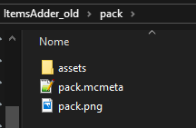

# Convert old files to v2



**It's recommended to start a fresh new world and don't use the old one as converters work but are experimental.**



## If you didn't create any custom item and you are using only my custom items please skip that tutorial, you don't need to convert files. But be sure to follow the tutorial "Convert old items ingame"

You just have to rename ItemsAdder folder to ItemsAdder\_backup, delete the old plugin and install the 2.0 version


### What changed?

ItemsAdder v2 is a complete recode of previous ItemsAdder version. It changed EVERY configuration and every resourcepack file path/properties/format.   
It's like a brand new plugin, with more features, more optimized and easier to maintain.

### How can I convert old configuration files and resourcepacks to the new format?

You have to follow this tutorial :D


**Please be sure to follow the tutorial carefully**, don't be in a hurry or you could make mistakes and take longer to do the conversion.



Do this operation only on a local test server on your PC so you won't make mistakes and risk losing data.



## Step 1

* Disable old ItemsAdder plugin from your test server \(delete the ItemsAdder.jar and stop server\)
* Download the [ItemsAdder Converter ](https://www.spigotmc.org/resources/itemsadder-converter.75952/)and put it into your test server plugins folder.

## Step 2 - copy items configs

* Open server **plugins** folder and create a **new** folder named **ItemsAdder\_old**
* Open your **OLD** ItemsAdder folder and copy files from items folder **\(see screenshot\)**


* Paste the **items** folder into **ItemsAdder\_old**


## Step 3 - copy resourcepack

* Create a **new** folder named **pack** inside **ItemsAdder\_old** 
* Extract the exact **CONTENT** of your old resourcepack **.zip** file inside the new folder **pack**



## Step 4 - Prepare new ItemsAdder 2.0


I**f you don't care and don't want to get my custom items and you just want to create your own items:** 

open `config.yml` in the **ItemsAdder** folder \(just generated by **ItemsAdder 2.0** version\) and set these properties to false.

```text
extract-default-items: false
extract-default-resources: false
```

Then delete all folders inside `ItemsAdder\data\items_packs\...` **but keep** `minecraft` folder.  
And delete all folders inside `ItemsAdder\data\resource_pack\assets\...` **but keep** `minecraft` folder.

You also have to remove my categories from `ia_gui.yml`


## Step 5 - preparing the converter


ItemsAdder converter will skip automatically my custom items, so it will create a pack that contains only items that you created on your own.


#### Configure it before start conversion

* Open file `plugins/ItemsAdderConverter/config.yml`
* Edit `namespace` to a custom name. You can chose your server name or whatever you want. For example some of my items have **namespace** "`itemsadder`" so you'll be able to use command like `/iaget itemsadder:ruby` \(but as you can notice I created more namespaces in the new plugin, in order to separate functionalities\)

## Step 6 - conversion

To start the conversion:

* start the server
* wait it to finish loading all
* use command `/itemsadderconverter:iaconvert`
* **WAIT** IT TO **FINISH**
* Check if it throws any error
* **Stop** server **only** when it **finished converting**.

## Installing ItemsAdder v2


* **Stop** the server
* Please make sure you **DELETED the old ItemsAdder.jar**
* If you have the OLD ItemsAdder folder in plugins please **RENAME** IT TO **ItemsAdder\_backup** or **delete** it if you already have backups.
* **Download** ItemsAdder 2.0 and put it in your plugins folder
* **Start** server
* Wait ItemsAdder 2.0 to finish creating its files
* **Stop** the server
* If you get any error please read it and check if you did anything wrong \(missing dependency, wrong Spigot version....\) and retry this step.
* \(IGNORE if you get error about the resourcepack URL, it's normal as you will configure it later\)
* Open folder **ItemsAdder\_converted** which is just created
* copy the two folders `items_packs` and `resource_pack`into new `ItemsAdder` folder \(replace any file if asked\)


## Last tasks

* delete `ItemsAdderConverter`, `ItemsAdder_converted`, `ItemsAdder_old` folders.
* delete `ItemsAdderConverter.jar`

## Resourcepack configuration

Please follow this fast tutorial to activate resourcepack:




\*\*\*\*

